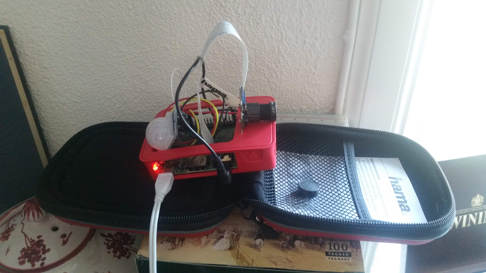
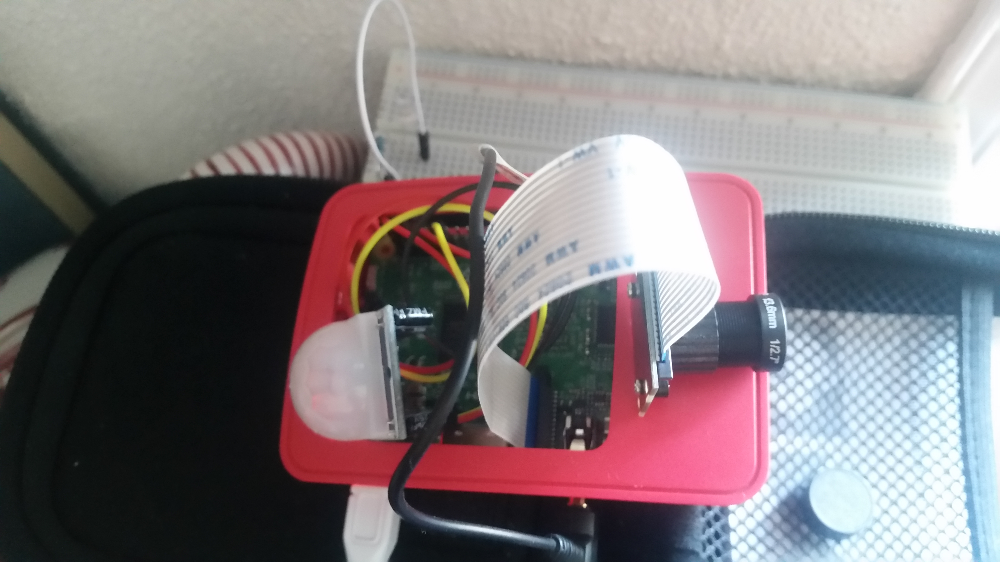

A basic home security system as a WOT-Thing, using a Raspberry Pi and integrated with slack to send messages and recieve commands.

The Pi is based on the [example](https://github.com/webofthings/webofthings.js) from the Web Of Things-book by Dominique D. Guinard and Vlad M. Trifa.

# How it works
The Pi will, when turned on:
  * Have a motion sensor that can be turned on and off if the right code is supplied. If the motion sensor is on, a LED is on as well.
  * Have a camera that will take a picture when told.
  * Have a speaker that will make a sound when called.
  * If the motion sensor is activated, the Pi will automatically take a picture, sound the sound, and send the picture to all the subscribed users.

  

